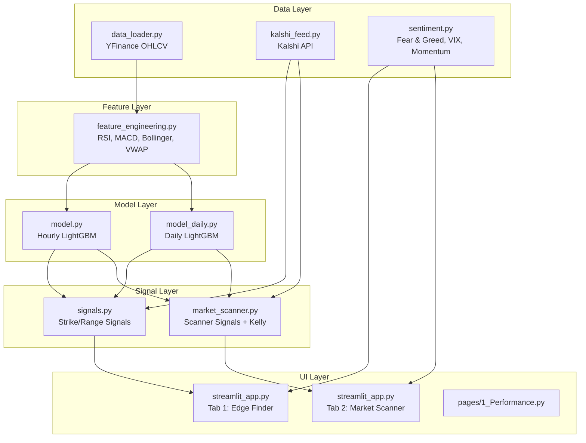

# Codebase Overview — Prediction Market Edge Finder

## Architecture

---

## File-by-File Reference

### Entry Points

| File | Purpose |
|---|---|
| `streamlit_app.py` | Main Streamlit app. Two tabs: Kalshi Edge Finder (existing) and Market Scanner (new). ~1160 lines. |
| `pages/1_Performance.py` | Streamlit page for model performance analytics (Trust Engine metrics, PnL backtest, calibration curve). |

### `src/` — Core Modules

| File | Purpose | Key Exports |
|---|---|---|
| `data_loader.py` | Fetches OHLCV from YFinance. Ticker mapping (SPX→^GSPC). | `fetch_data()`, `save_data()`, `load_data()` |
| `feature_engineering.py` | Creates technical indicators (RSI, MACD, Bollinger, VWAP, log returns, lags). | `create_features()`, `prepare_training_data()` |
| `model.py` | Hourly LightGBM: train, predict, validate features, calculate probability. Dynamically loads via Hugging Face Hub. | `train_model()`, `predict_next_hour()`, `FeatureMismatchError` |
| `model_daily.py` | Daily LightGBM: aggregates hourly data into daily features. Dynamically loads via Hugging Face Hub. | `prepare_daily_data()`, `train_daily_model()`, `load_daily_model()` |
| `kalshi_feed.py` | Fetches markets from Kalshi API (targeted + fallback). Processes strikes/ranges. | `get_real_kalshi_markets()`, `check_kalshi_connection()` |
| `kalshi_portfolio.py`| **[NEW]** Read-only Kalshi portfolio client with RSA-PSS auth, tracks live P&L and triggers Smart Exit alerts. | `KalshiPortfolio`, `get_portfolio_summary()` |
| `market_scanner.py` | Kalshi scanner: multi-asset scan, edge/Kelly signal generation, signal card UI. | `KalshiScanner`, `SignalGenerator`, `ScannerDashboard` |
| `sentiment.py` | 3-source sentiment: Fear & Greed API, VIX-derived, momentum. Composite scores. | `SentimentAnalyzer`, `get_sentiment_features()`, `render_sentiment_panel()` |
| `signals.py` | Generates directional (BUY YES/NO) and range signals from model predictions. | `generate_trading_signals()` |
| `backtester.py` | **[NEW]** Predicts P&L of historical logs natively with Kalshi math. Calculates Sharpe Ratio and Max Drawdown. | `simulate_backtest()`, `calculate_metrics()` |
| `evaluation.py` | Model metrics: MAE, RMSE, directional accuracy, Brier score, PnL backtest. | `evaluate_model()` |
| `utils.py` | Market status detection, timeframe selection, market categorization. | `get_market_status()`, `determine_best_timeframe()`, `categorize_markets()` |
| `azure_logger.py` | Logs predictions to Azure Blob Storage. Fetches historical logs. | `log_prediction()`, `fetch_all_logs()` |

### `config/`

| File | Purpose |
|---|---|
| `settings.yaml` | Centralized configuration: data sources, sentiment weights, model hyperparameters, trading thresholds. |

### `scripts/` — Utilities

| File | Purpose |
|---|---|
| `backfill_azure.py` | Backfill prediction logs to Azure |
| `force_retrain.py` | Force model retraining |
| `train_all_models.py` | Train all hourly models |
| `train_daily_models.py` | Train all daily models |
| `generate_market_snapshot.py` | Generate market snapshot report |
| `check_for_empty_loops.py` | Diagnostic: check for empty scanner loops |
| `debug_kalshi.py` | Debug Kalshi API connectivity |

---

## Data Flow

1. **Fetch**: `data_loader.py` pulls OHLCV from YFinance for each asset
2. **Engineer**: `feature_engineering.py` creates ~20 technical indicators
3. **Cache & Load**: `model.py` / `model_daily.py` dynamically fetches latest `.pkl` weights from the Hugging Face Hub (`KevinSigey/Kalshi-LightGBM`).
4. **Market Data**: `kalshi_feed.py` fetches live Kalshi markets, categorized into hourly/daily/range buckets
5. **Predict**: Models predict next-hour or end-of-day prices
6. **Signal**: `signals.py` generates BUY YES/NO signals by comparing model probability to market prices
7. **Risk & Defense**: `kalshi_portfolio.py` monitors active positions and raises "Smart Exit Alerts" on decaying edge or high Market Heat.
8. **Sentiment**: `sentiment.py` overlays composite sentiment from 3 sources
9. **Display**: `streamlit_app.py` renders everything in a tabbed UI, including the `backtester.py` Risk Management tab.

---

## Environment Variables

| Variable | Required | Purpose |
|---|---|---|
| `KALSHI_API_KEY` | Yes | RSA private key for Kalshi API authentication |
| `AZURE_CONNECTION_STRING` | No | Azure Blob Storage for prediction logging |

---

## Removed Files (Cleanup)

The following files were removed during the refactor:
- `src/data_ingest.py`, `src/data_transformation.py` — empty placeholders
- `debug_feed.py`, `test_api.py`, `test_auto_retrain.py`, `test_categorization.py`, `test_expirations.py`, `test_new_categorization.py`, `test_range_logic.py` — standalone debug/test scripts
- `market_data.json` — stale sample data
- `market_scanner_app.py` — Polymarket scanner (replaced by Kalshi-based `src/market_scanner.py`)
- `INTEGRATION_PROMPT.md`, `README 2.md`, `requirements_minimal.txt` — consumed integration docs
